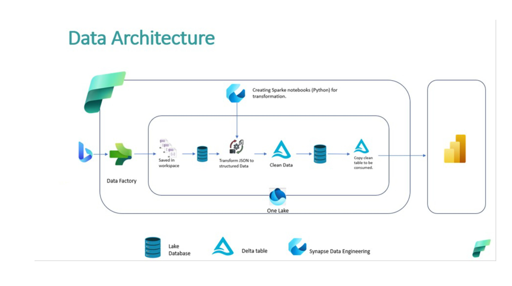
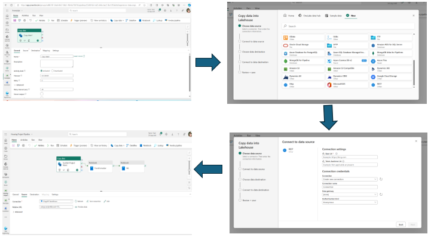
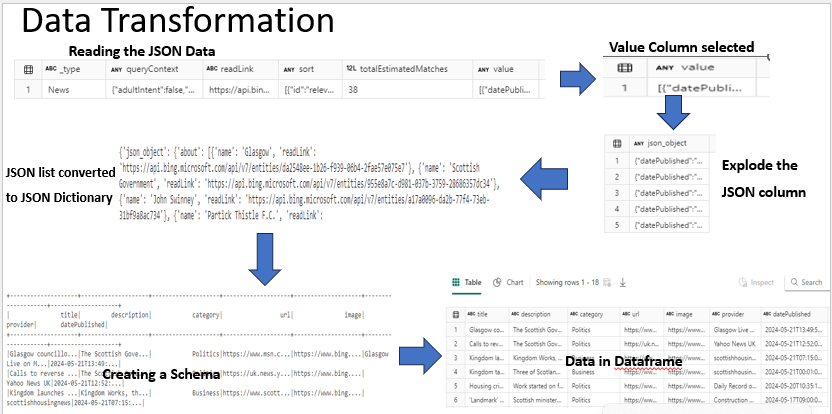
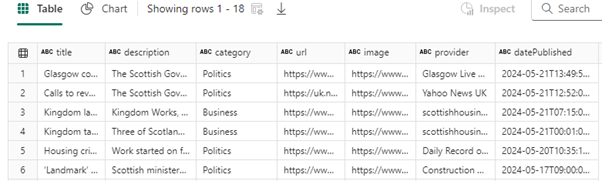
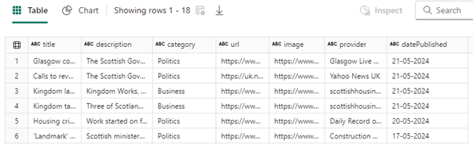
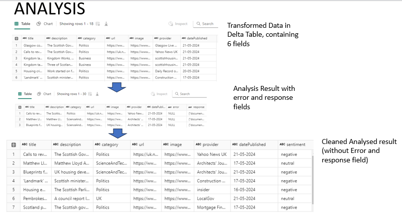
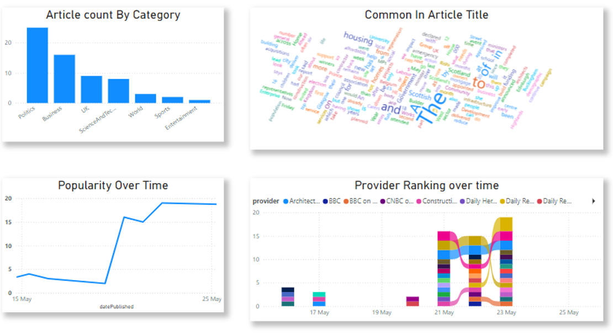

# Microsoft_fabric_Scottish-Housing-Market-Data-Repository-and-Analysis

## Introduction
This project leverages data engineering and analysis techniques to create a comprehensive data repository for analyzing and tracking housing projects within Scotland. By collecting and processing news articles related to Scottish housing, this platform aims to provide valuable insights for various stakeholders, including investment firms, mortgage providers, and financial institutions.

## Problem Statement
The Scottish housing market is influenced by various factors reported in news articles. However, the data is often scattered and unstructured, making it challenging for analysts to extract meaningful insights.
This project addresses this problem by:

   * Centralizing news data related to Scottish housing projects.
  
   * Transforming unstructured news articles into structured data.
  
   * Performing sentiment analysis to understand public perception.
  
   * Storing the processed data in a format suitable for analysis and reporting.

## Project Objectives
The primary objectives of this project are:

 * Environment Setting: Setting up Azure account and Microsoft Fabric. Also designing the Data Architecture
  
 * Data Collection: Aggregate news articles related to housing projects in Scotland from various sources.
  
 * Data Processing: Clean, transform, and store the collected data in a structured format.
  
 * Sentiment Analysis: Perform sentiment analysis on the news articles to gauge public perception.
  
 * Data Storage: Store the processed data in a Delta table for efficient querying and analysis.
  
 * Insights Generation: Provide a robust dataset that housing analysts can use to derive valuable insights.

## Data architecture

The Project employs a robust data architecture to collect, process, store, analyze, and visualize housing-related news.
Data is sourced from the Bing News API and stored in Lake Database. Using Synapse Spark Nootbook, the data undergoes transformation, cleaning, and sentiment analysis via SynapseML.
The cleaned and enriched data is stored in Delta Lake tables, enabling efficient incremental updates. 
Power BI is used for creating interactive dashboards and visualizations, providing stakeholders with valuable insights into housing trends, sentiment analysis, and news categorization.

## Environment Setting
An Azure Account was created in other to provide access Microsoft's cloud services. This account gives access to creating Bing News API which allows me to programmatically fetch real-time news articles related to housing in Scotland. This step is crucial to obtain API Keys. The API keys generated enable secure and authorized access to Bing's news data, allowing us continuously update our dataset with the latest information.
Accessing the Microsoft Fabric Account: Microsoft Fabric was the second environment setup because it provides an integrated environment that combines multiple data services such as Synapse Analytics, Power BI, and Delta Lake.
This integrated platform enhances efficiency, collaboration, and scalability, supporting all stages of the data lifecycle from raw data acquisition to actionable insights.

## Data Collection

After setting up the account, the next step is to navigate to Data Factory within Data Fabric. Data Factory is a cloud-based data integration service that allows me to create, schedule, and orchestrate data workflows, making it a key component for managing data ingestion processes.
A Lakehouse is created within Data Fabric to enable efficient storage and querying of large datasets.
The above diagram is a pictural representation of the Steps taken to create a pipeline.
A detailed pipeline is set up to extract data from the Bing Search API, incorporating necessary query parameters, headers, and the API key, with a schedule to automate daily data retrieval. The  query created for the search to automatically append daily news to our data for the first 100 records using parameters freshness, count, and our market is en-GB in the relative URL. This step ensures that only the most relevant and recent news articles are appended to the dataset, optimizing the quality and relevance of the data being ingested. The ingested data was stored in Lake House

## Data Processing

The JSON data is read into a Spark DataFrame with the multiline option enabled to handle multi-line JSON records.
The DataFrame is filtered to select only the value column, which contains the JSON data.
The JSON data within the value column is exploded into individual rows, with each row representing a JSON object.
The exploded DataFrame is converted to a list of JSON strings for easier processing.
Each JSON string is parsed to extract specific fields: title, description, category, Url, image, provider, and datePublished.
A schema is defined to structure the extracted data.
The lists of extracted data are combined and converted into a Spark DataFrame using the defined schema.

#### Data cleaning
Datapublished before formatting                        |   Datapublished after formatting
:----------------------------------------------------: | :-----------------------------------------------------
                              | 

The datePublished column is formatted to a standard date format (dd-MM-yyyy).

#### Data Storage: For effective searching and analysis, store the converted data in Azure Data Lake's Delta tables

## Sentiment Analysis

Sentiment analysis is performed on the description column of the DataFrame using the SynapseML library.
The AnalyzeText transformer is configured to analyze sentiment and output the results into the response column.
The sentiment results are extracted from the response column and added as a new sentiment column in the DataFrame.
The intermediate error and response columns are dropped for a cleaner final DataFrame.

## Data Storage
Leveraging on the strengths of Delta Lake and PySpark within the Microsoft Fabric environment using below processes
* Schema was defined to include necessary fields such as title, description, category, URL, image, provider, and datePublished
* Creating and Update Table: The Delta tables are updated each day using merge operations which helps to remove duplicate also
* Data Storage: Data Lake is used to store the Data

## Dashboard

 

